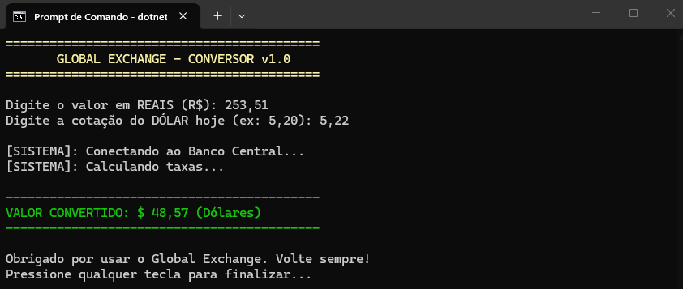

# 🔄 Projeto ConversorExpert

Este projeto é uma aplicação de console em **C# utilizando .NET** que realiza conversões com interação via terminal.

O objetivo da atividade foi aplicar conceitos de **Experiência do Usuário (UX)** dentro de um ambiente de linha de comando, utilizando heurísticas de usabilidade.

---

## 🛠️ Comandos Utilizados

- `dotnet new console -n ConversorExpert`  
  Cria a estrutura inicial do projeto com o nome "ConversorExpert".

- `cd ConversorExpert`  
  Acessa a pasta do projeto.

- `code .`  
  Abre a IDE.

- `dotnet run`  
  Executa o programa no terminal.

---

## 📦 Estrutura do Projeto

Arquivos principais:

1. `Program.cs`  
   Contém a lógica do sistema.

2. `ConversorExpert.csproj`  
   Arquivo de configuração do projeto.

Framework utilizado:

- `.NET 10.0 (net10.0)`

---

## 🧠 Heurísticas de UX Aplicadas

### 1️⃣ Visibilidade do Status do Sistema

O sistema informa ao usuário o que está acontecendo durante a execução, exibindo mensagens no terminal ao longo do processo.

Isso evita que o usuário pense que o programa travou.

---

### 2️⃣ Prevenção de Erros

O sistema orienta o usuário durante a entrada de dados, solicitando informações de forma clara.

Isso reduz a chance de erros durante a utilização.

---

### 3️⃣ Estética e Design Minimalista

O programa apresenta apenas as informações necessárias, de forma organizada e clara no terminal.

Isso facilita a leitura e melhora a experiência do usuário.

---
## 🧠 Reflexão de Encerramento

> Após passar por essas 4 missões, como a sua visão sobre "apenas escrever código" mudou ao considerar a experiência de quem vai usar o seu programa?

Minha visão evoluiu de simplesmente fazer o código funcionar para me preocupar com a experiência do usuário. Percebi que não basta executar corretamente, é essencial comunicar o que está acontecendo, evitar erros e tornar a interação clara e intuitiva. Um sistema bem feito não é só funcional, mas também compreensível e confiável para quem utiliza.

---

## 📸 Evidência de Execução

Print do sistema funcionando com o comando `dotnet run`.

 

